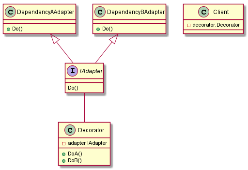

# Golang Abstraction

## Motivation

When design system we used to spent lot of time to reduce the dependencies between our application with other third-party and low level (dependencies) api such as Database, Storage, Queue...

This `goabs` repo provide packages that add a abstraction layer between your application code and other dependencies.

Belong with the abstraction layer, this repo also provide the adapter to connect the abstraction layer with the dependencies.

## The Idea

The general idea is introduce some abstraction interface and decorator which help to create a boundary between the application code with the dependencies

You can reference this as 

## TODO

- [ ] [WIP] Logging
  - [x] Abstraction and default implementation
  - [ ] Logrus adapter
  - [ ] Zap adapter
- [ ] Queue & Worker Pool
- [ ] Event Bus
- [ ] Caching
- [ ] Mediator
- [ ] Tracing? (we can use opencensus)
- [ ] HTTP Routing?

## Contributor seeding

As this is an open source, I always welcome your contribution. So please send me your idea or pull requests.
