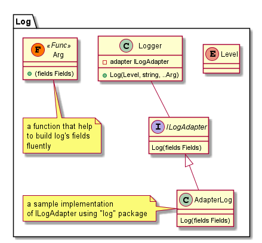

# Logging

This package provide methods that help in logging you can change the log engine by changing the log adapter which implements the `ILogAdapter` interface

## Design



## Usage

### Install

```bash
go get github.com/jkaveri/goabs/log
# install adapter
# for example, if you use logrus
go get github.com/jkaveri/goabs/log/adapter-logrus
```

### Default

You can start using log package with default configuration which will use `AdapterLog`  as an adapter which uses "log" package as log engine

```go
func man() {
	// simple log with level "info"
	log.Info("this is an log message")
	// log with error
	log.Error(
		"this is an error log message", 
		log.WithError(errors.New("simple eror")),
	)
	// log with custom field
	log.Trace(
		"this is an trace message with username",
		log.WithField("username", "jkaveri"),
		log.WithField("repo", "github.com/jkaveri/goabs"),
	)
}
```
### Use with logrus

```go
    logger := logrus.New()
    logger.SetLevel(logrus.InfoLevel)
    log.Configure(
		    logadapter.NewAdapterLogrus(logger),
	  )
	  
    log.Info("this is log message")
    
    log.Info(
        "this is formatted message: %d",
        log.WithFormatArg(10),
    )
    
    log.Info(
        "this is full feature of %s",
        log.WithFormatArg("logging"),
        log.WithFields(log.Fields{
          "username": "some username",
          "score":    15.2,
        }),
        log.WithField("age", 10),
        log.WithError(errors.New("test error")),
    )
```


### Use another log engine

You can use any log engine which you like and familiar with. Just implement the `ILogAdapter`

```go
type ILogAdapter interface {
	Log(fields Fields)
}
```

When you implemented the adapter you can configure log package to use your adapter:

```go
log.Configure(mylogadapter.NewAdapter())
```

### Examples

- [Use with logrus](../examples/log-logrus/log-logrus.go)